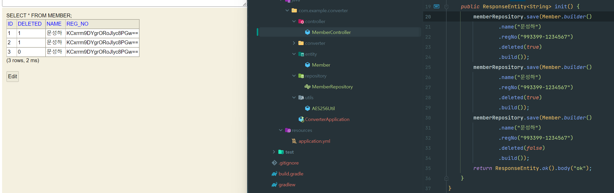

# JPA Converter

자비스앤빌런즈 실무 면접에 나온 Converter 사용 연습.

## 요약

주민번호와 같은 민감정보를 데이터 베이스에 저장할 땐 암호화 하는 등, 데이터 베이스에 저장할 때와 불러올 때의 값이 다를 때 이용할 수 있겠다.



## Converter

먼저 `AttributeConverter<T, T>` 를 상속받아 database 로 갈때와 entity attribute 로 사용할 때를 작성한다.

### AES256Converter

주민번호 등 암호화 Converter

```java

@RequiredArgsConstructor
@Converter
public class AES256Converter implements AttributeConverter<String, String> {

    private final AES256Util aes256Util;

    @Override
    public String convertToDatabaseColumn(String attribute) {
        try {
            return aes256Util.encrypt(attribute);
        } catch (Exception e) {
            throw new RuntimeException(e);
        }
    }

    @Override
    public String convertToEntityAttribute(String dbData) {
        try {
            return aes256Util.decrypt(dbData);
        } catch (Exception e) {
            throw new RuntimeException(e);
        }
    }
}
```

### BooleanToTinyintConverter

`boolean` 으로 사용하는 값이지만 database 에서는 `Tinyint`로 사용하는 경우

```java

@Converter
public class BooleanToTinyintConverter implements AttributeConverter<Boolean, Integer> {


    @Override
    public Integer convertToDatabaseColumn(Boolean attribute) {
        return (attribute != null && attribute) ? 1 : 0;
    }

    @Override
    public Boolean convertToEntityAttribute(Integer dbData) {
        return 1 == dbData;
    }
}
```

## Entity

엔티티에서 Converter 를 사용할 필드에 `@Convert` 어노테이션을 작성하면 끝.

```java

@Getter
@Builder
@AllArgsConstructor
@NoArgsConstructor(access = AccessLevel.PROTECTED)
@Entity
public class Member {
    @Id
    @GeneratedValue(strategy = GenerationType.IDENTITY)
    private long id;
    private String name;
    @Convert(converter = AES256Converter.class)
    private String regNo;
    @Convert(converter = BooleanToTinyintConverter.class)
    private boolean deleted;
}
```
