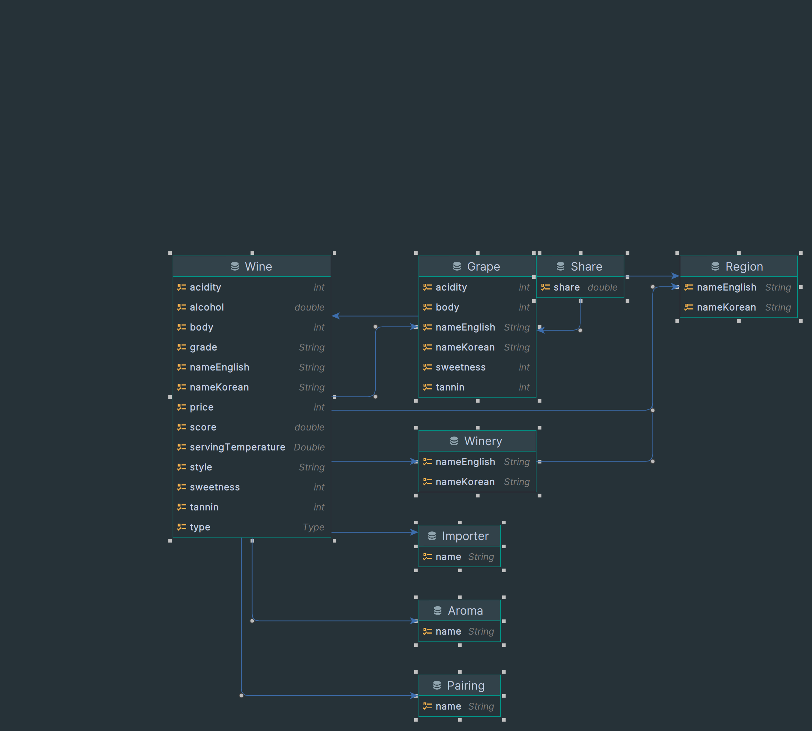

# READEME

---

## ER Diagram

entity 는 아래와 같이 구성되었습니다.



## Test Code

테스트 코드 및 Rest Docs는 Region만 작성하였습니다.

http://localhost:8080/docs/region.html

[RegionTest](src/test/kotlin/io/directional/wine/region)

## End to End

조회기능 구현 검증을 위해 SampleData와 Intellij Http Scratch 파일을 작성하였습니다.\
서버 구동시 init sample data 가 완료되었는지 확인해 주세요.

[scratch](scratch/end-to-end.http)\
[SampleDataLoader](src/main/kotlin/io/directional/wine/SampleDataLoader.kt)

```console
2023-07-22T10:05:45.570+09:00  INFO 31820 --- [  restartedMain] o.s.b.w.embedded.tomcat.TomcatWebServer  : Tomcat started on port(s): 8080 (http) with context path ''
2023-07-22T10:05:45.575+09:00  INFO 31820 --- [  restartedMain] io.directional.wine.WineApplicationKt    : Started WineApplicationKt in 3.193 seconds (process running for 3.5)
======================================
[init sample data] start 2023-07-22T10:05:45.579810500
[init sample data] end 2023-07-22T10:05:52.452325800
======================================
```

# 이슈

---

## querydsl 버전

Spring Boot 2.6.x 이후

- querydsl 5.0.0 사용
- querydsl 4.4.0은 지원하지 않는다.

Spring Boot 3.0.0 이전

```kotlin
implementation("com.querydsl:querydsl-jpa:5.0.0:jpa")
kapt("com.querydsl:querydsl-apt:5.0.0:jpa")
```

Spring Boot 3.0.0 이후

```kotlin
implementation("com.querydsl:querydsl-jpa:5.0.0:jakarta")
kapt("com.querydsl:querydsl-apt:5.0.0:jakarta")
```

Spring Boot 3 버전 이후 persistent 가 변경되어 `jakarata`를 사용해야한다.

## querydsl transform

response dto 생성을 위하여 querydsl transform을 사용할 때 아래 에러가 발생하였다.

```shell
'java.lang.Object org.hibernate.ScrollableResults.get(int)'
java.lang.NoSuchMethodError: 'java.lang.Object org.hibernate.ScrollableResults.get(int)'
```

Hibernate 6.x. 버전 이상에서 `JPQLTemplates` 를 `Default`로 지정하라고 한다.\
___현재 프로젝트 기준 Spring Boot Data Jpa 3.1.1 에서 사용중인 Hibernate 버전은 6.2.5___

```kotlin
@Bean
fun jpaQueryFactory(): JPAQueryFactory {
    // return JPAQueryFactory(entityManager) <-- before
    return JPAQueryFactory(JPQLTemplates.DEFAULT, entityManager)
}
```

참조: https://github.com/querydsl/querydsl/issues/3428

---

# Backend Developer

## Steps

1. main branch로 부터 새로운 branch를 생성합니다.
2. 요구 사항(Requirements)을 만족하는 API를 새로운 branch에 구현합니다.
3. 생성한 branch를 main으로 merge하는 merge(pull) request를 생성합니다.

## Requirements

* [data](data) 폴더의 파일을 참고하여 entity 설계
* 해당 데이터들을 삽입, 수정, 삭제, 조회할 수 있는 API 구현
* 조회 기능은 다음을 포함
    * 와인 조회
        * 필터링: 와인 종류, 알코올 도수 범위, 와인의 가격 범위, 와인의 스타일, 와인의 등급, 지역
        * 정렬: 와인 이름, 알코올 도수, 산도, 바디감, 단맛, 타닌, 와인의 점수, 와인의 가격
        * 검색: 와인 이름
    * 와이너리 조회
        * 필터링: 지역
        * 정렬: 와이너리 이름
        * 검색: 와이너리 이름
    * 포도 품종 조회
        * 필터링: 지역
        * 정렬: 포도 품종 이름, 산도, 바디감, 단맛, 타닌
        * 검색: 포도 품종 이름
    * 지역 조회
        * 필터링: 상위 지역
        * 정렬: 지역 이름
        * 검색: 지역 이름
    * 수입사 조회
        * 정렬: 수입사 이름
        * 검색: 수입사 이름
* 조회 기능은 다음 정보를 제공
    * 와인 조회
        * 다수 조회 시: 와인의 종류, 와인 이름, 최상위 지역 이름
        * 단일 조회 시: 와인의 종류, 와인 이름, 알코올 도수, 산도, 바디감, 단맛, 타닌, 와인의 점수, 와인의 가격, 와인의 스타일, 와인의 등급, 수입사 이름, 와이너리 이름, 와이너리
          지역, 지역 이름 및 모든 상위 지역 이름, 와인의 향, 와인과 어울리는 음식, 포도 품종
    * 와이너리 조회
        * 다수 조회 시: 와이너리 이름, 지역 이름
        * 단일 조회 시: 와이너리 이름, 지역 이름, 와이너리의 와인
    * 포도 품종 조회
        * 다수 조회 시: 포도 품종 이름, 지역 이름
        * 단일 조회 시: 포도 품종 이름, 산도, 바디감, 단맛, 타닌, 지역 이름, 포도 품종의 와인
    * 지역 조회
        * 다수 조회 시: 지역 이름
        * 단일 조회 시: 지역 이름, 모든 상위 지역 이름, 포도 품종, 와이너리 이름, 와인 이름
    * 수입사 조회
        * 다수 조회 시: 수입사 이름
        * 단일 조회 시: 수입사 이름, 수입사의 와인

## Data description

### Wine

#### wine.csv

* `type`: 와인의 종류
* `name_korean`: 와인 이름(한글)
* `name_english`: 와인 이름(영어)
* `alcohol`: 알코올 도수
* `acidity`: 산도
* `body`: 바디감
* `sweetness`: 단맛
* `tannin`: 타닌
* `serving_temperature`: 권장섭취온도
* `score`: 와인의 점수
* `price`: 와인의 가격
* `style`: 와인의 스타일
* `grade`: 와인의 등급
* `importer`: 수입사
* `winery_name_korean`: 와이너리 이름(한글)
* `winery_name_english`: 와이너리 이름(영어)
* `region_name_korean`: 지역 이름(한글)
* `region_name_english`: 지역 이름(영어)

#### wine_aroma.csv

* `name_korean`: 와인 이름(한글)
* `name_english`: 와인 이름(영어)
* `aroma`: 와인의 향

#### wine_pairing.csv

* `name_korean`: 와인 이름(한글)
* `name_english`: 와인 이름(영어)
* `pairing`: 와인과 어울리는 음식

#### wine_grape.csv

* `name_korean`: 와인 이름(한글)
* `name_english`: 와인 이름(영어)
* `grape_name_korean`: 포도 품종(한글)
* `grape_name_english`: 포도 품종(영어)

### Winery

#### winery.csv

* `name_korean`: 와이너리 이름(한글)
* `name_english`: 와이너리 이름(영어)
* `region_name_korean`: 지역 이름(한글)
* `region_name_english`: 지역 이름(영어)

### Grape

#### grape.csv

* `name_korean`: 포도 품종(한글)
* `name_english`: 포도 품종(영어)
* `acidity`: 산도
* `body`: 바디감
* `sweetness`: 단맛
* `tannin`: 타닌

#### grape_share.csv

* `name_korean`: 포도 품종(한글)
* `name_english`: 포도 품종(영어)
* `share`: 포도 품종의 비율
* `region_name_korean`: 지역 이름(한글)
* `region_name_english`: 지역 이름(영어)

### Region

#### region.csv

* `name_korean`: 지역 이름(한글)
* `name_english`: 지역 이름(영어)
* `parent_name_korean`: 상위 지역 이름(한글)
* `parent_name_english`: 상위 지역 이름(영어)
